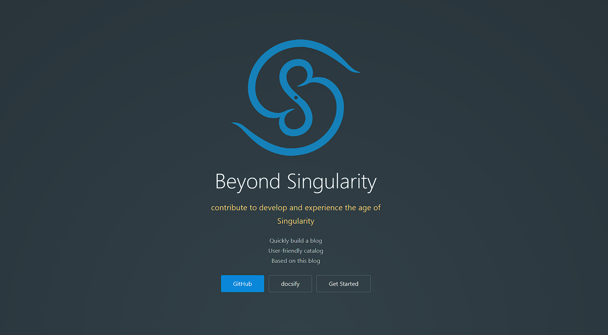
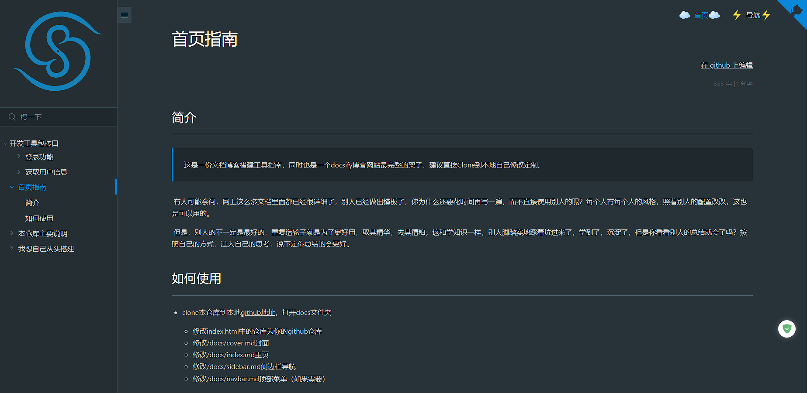
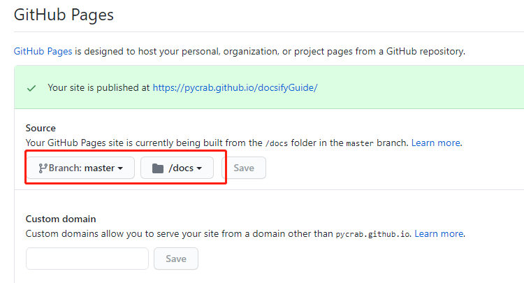

# docsify文档网站创建教程<!-- {docsify-ignore} -->

> 网站搭建千千万，搭完不用全白干。

用docsify搭建,并部署到GitHub Pages

在线预览页面：https://andy-brain.github.io/BSdocsify/#/

## 效果展示

- 网站首页

  

- 文章页面

  
  

## 参考文档

- [docsify官方中文文档](https://docsify.js.org/#/zh-cn/quickstart)
- 官方文档很浅显，还需要详细解惑，[直接引用一下](https://segmentfault.com/a/1190000017576714)老哥
- 一开始还是因为看了Guide哥的[手把手这篇文章](https://mp.weixin.qq.com/s?__biz=Mzg2OTA0Njk0OA==&mid=2247486555&idx=2&sn=8486026ee9f9ba645ff0363df6036184&chksm=cea24390f9d5ca86ff4177c0aca5e719de17dc89e918212513ee661dd56f17ca8269f4a6e303&token=298703358&lang=zh_CN#rd)才开始搭建的，感谢！

## 准备

- 初始化一个GitHub仓库，并clone到本地

- 电脑已安装npm包管理工具

  全局安装docsify脚手架`npm i docsify-cli -g`，注意是安装脚手架docsify-cli，不是安装docsify！

## 快速搭建

在clone的本地仓库目录下：

- 初始化项目文件夹docs

  `docsify init docs`

- 本地预览

  `docsify serve docs`，浏览器打开localhost:3000页面即可看到。

- 全局命令启动本地预览（可选）

  - `npm init -y`初始化一个package.json文件
  - 打开并在scripts中写入`"doc": "docsify serve docs"`
  - 之后就可以使用全局命令`npm run doc`启动本地预览啦。

使用脚手架就这么简单，我还以为啥呢，但是现在是光秃秃的野人版，我们还得定制一下。

## 快速部署

> 先部署一下，后面的定制内容有可能会用到部署地址。

### 部署到GitHub Pages

仓库Settings里面开启GitHub Pages即可，注意docs路径：



## 私人定制

刚刚我们已经初始化了一个docs文件夹，docsify在里面定义了几个文件，其中的index.html是我们的配置中心，先贴一下我依次配置了哪些内容，后面慢慢说。

```html
<!DOCTYPE html>
<html lang="en">
<head>

 <meta charset="UTF-8">
 <title>Beyond singularity</title>
 <meta http-equiv="X-UA-Compatible" content="IE=edge,chrome=1" />
 <meta name="renderer" content="webkit">
 <meta name="viewport" content="width=device-width, user-scalable=no, initial-scale=1.0, maximum-scale=1.0, minimum-scale=1.0">

  <!-- Theme: Simple Dark -->
  <link rel="stylesheet" href="https://cdn.jsdelivr.net/npm/docsify-themeable@0/dist/css/theme-simple-dark.css">
  
  <!-- 主题 -->
  <!--<link rel="stylesheet" href="//cdn.jsdelivr.net/npm/docsify/lib/themes/buble.css">-->
  <!--<link rel="stylesheet" href="//cdn.jsdelivr.net/npm/docsify/lib/themes/vue.css">-->
  <!--<link rel="stylesheet" href="//cdn.jsdelivr.net/npm/docsify/lib/themes/dark.css">-->
  <!--<link rel="stylesheet" href="//cdn.jsdelivr.net/npm/docsify/lib/themes/pure.css">-->
  <!--<link rel="stylesheet" href="//cdn.jsdelivr.net/npm/docsify/themes/dolphin.css">
  <link rel="stylesheet" href="/themes/vue.css" title="vue" disabled />
  <link rel="stylesheet" href="/themes/dark.css" title="dark" disabled />
  <link rel="stylesheet" href="/themes/buble.css" title="buble" disabled />
  <link rel="stylesheet" href="/themes/pure.css" title="pure" disabled />
  <link rel="stylesheet" href="/themes/dolphin.css" title="dolphin" disabled />-->
  
  <link rel="stylesheet" href="//cdn.jsdelivr.net/npm/docsify-sidebar-collapse/dist/sidebar.min.css" />
  <!--<link rel="stylesheet" href="//cdn.jsdelivr.net/npm/docsify-sidebar-collapse/dist/sidebar-folder.min.css" />-->
  
  <!-- 侧边栏logo样式 -->
 <!--<style>
    .app-name-link > img{
      width: 50%;
    }
 </style>-->
 <style>
  nav.app-nav li ul {
    min-width: 100px;
  }

  #carbonads {
    box-shadow: none !important;
    width: auto !important;
  }
 </style>

</head>
<body>

  <!-- Loading dialog -->
  <div id="app">wait loading...</div>
  <script src="//cdn.jsdelivr.net/npm/docsify-edit-on-github"></script>
  
  <script>
   const lang = location.hash.match(/#\/(de-de|es|ru-ru|zh-cn)\//);
    if (lang) {
     document.documentElement.setAttribute('lang', lang[1]);
     }
    
   window.$docsify = {
      // 路由映射，固定根目录的文件 
      alias: {
        '/.*/sidebar.md': '/sidebar.md',
        '/.*/navbar.md': '/navbar.md'
       },                                                             
      // edit-on-github,末尾的,是必要的
      plugins: [
        EditOnGithubPlugin.create('https://github.com/andy-brain/BSdocsify/blob/master/docs/')
      ],
        
        
     repo: 'https://github.com/andy-brain/BSdocsify',   // 右上角github小部件链接
     // themeColor: '#3F51B5',       // 样式主颜色
     // notFoundPage: '404.md',       // 404页面
      externalLinkTarget: '_blank',   //外链打开方式，_blank表示在新窗口打开
      topMargin: 90,                  // 内容距离顶部的高度

      auto2top: true,                 // url变化自动滚动到顶部
      loadNavbar: 'navbar.md',        // 导航栏
      homepage: 'index.md',
      onlyCover: true,          // 设置了封面后，开启网站只进入封面（默认封面和首页是一页，可以向下滑动）
      coverpage: 'cover.md',          // 自定义封面

      //侧边栏//

      // hideSidebar: 'true',    // 是否隐藏侧边栏
      // 侧边栏顶部标题
      //name: '🌌', 
      name: 'Beyond Singularity',
      logo: '/pic/beyondsingularity2.png',    // logo和name 图标二选一
      nameLink: 'https://github.com/andy-brain/BSdocsify',  // 侧边栏顶部标题或logo链接
      loadSidebar: 'sidebar.md',       // 自定义侧边栏
      subMaxLevel: 6,                  // 自定义侧边栏最大层级
      mergeNavbar: true,            // 小屏自动合并导航栏和侧边栏
      autoHeader: true,             // 侧边栏目录作为内容标题
      sidebarDisplayLevel: 2,
      
      
      //插件区域//

      // 全文搜索
      search: {
        maxAge: 86400000,     //（毫秒）过期时间一天 
        paths: 'auto',
        placeholder: '搜一下',
        noData: '未果',
        depth: '6'
      },
      // 字数统计
      count:{
        countable: true,
        position: 'top',
        margin: '10px',
        float: 'right',
        fontsize:'0.9em',
        color:'rgb(90,90,90)',
        language:'chinese',
        localization: {
          words: "",
          minute: ""
        },
          isExpected: true
      },
      // 文本高亮
        'flexible-alerts': {
          style: 'flat',
          note: {
            label: "信息"
             },
          tip: {
            label: "提示"
            },
          warning: {
           label: "注意"
            },
          attention: {
            label: "切记"
            }
          },
      // 分页导航插件
      pagination: {
        previousText: '上一卷',
        nextText: '下一卷',
        //crossChapter: true,
        //crossChapterText: true
        },
      // 页脚信息插件
        loadFooter: true,
        loadFooter: 'footer.md'  
    }
  </script>
  <!--<script src="//cdn.jsdelivr.net/npm/docsify/lib/plugins/ga.min.js"></script>-->
 
  <script src="//cdn.jsdelivr.net/npm/docsify/lib/docsify.min.js"></script>

  <script src="//cdn.jsdelivr.net/npm/docsify-copy-code"></script>
  <script src="https://cdn.jsdelivr.net/npm/docsify-count@latest/dist/countable.min.js"></script>
  <!--代码格式化-->
  <script src="//unpkg.com/prismjs/components/prism-java.js"></script>
  <script src="//cdn.jsdelivr.net/npm/docsify/lib/plugins/emoji.min.js"></script>
  <script src="//cdn.jsdelivr.net/npm/docsify/lib/plugins/search.min.js"></script>
  <script src="//cdn.jsdelivr.net/npm/docsify/lib/plugins/zoom-image.min.js"></script>
   
  <!-- 文本高亮 -->
   <script src="https://unpkg.com/docsify-plugin-flexible-alerts"></script>

  <script src="//cdn.jsdelivr.net/npm/docsify-sidebar-collapse/dist/docsify-sidebar-collapse.min.js"></script>
  <!--两列布局，-- slide:break-30 --在md中插入即可-->
  <script src="//unpkg.com/docsify-slides/dist/docsify-slides.min.js"></script>
  <!-- 分页导航 -->
  <!--<script src="//cdn.jsdelivr.net/npm/docsify-pagination/dist/docsify-pagination.min.js"></script>-->
  <!-- 外链脚本 -->
  <script src="//cdn.jsdelivr.net/npm/docsify/lib/plugins/external-script.min.js"></script>
  <!-- 页脚信息 -->
  <script src="//cdn.jsdelivr.net/npm/@alertbox/docsify-footer/dist/docsify-footer.min.js"></script>

  <!-- 评论 -->
  <link rel="stylesheet" href="//cdn.jsdelivr.net/npm/gitalk/dist/gitalk.css">
  <script src="//cdn.jsdelivr.net/npm/gitalk/dist/gitalk.min.js"></script>
  <script src="//cdn.jsdelivr.net/npm/docsify/lib/plugins/gitalk.min.js"></script>
  
  <script>
    const gitalk = new Gitalk({
      clientID: 'a0a12d9e735db8ad7b4a',
      clientSecret: '7ee19084c2460f77807b911f9980f3c367ae71d6',
      repo: 'adny-docsify',
      owner: 'andy-brain',
      //admin: ['andy-brain'],
      admin: ['Github repo collaborators, only these guys can initialize github issues'],
      // facebook-like distraction free mode
      distractionFreeMode: true
    })
  </script>
</body>
</html>
```

看到这密密麻麻的中文注释，是不是已经跃跃欲试了呢？继续。

### 主题设置

目前已经更新了五种主题，我已经列出来了，可以[在这里在线预览](https://docsify.js.org/#/zh-cn/themes?id=%e7%82%b9%e5%87%bb%e5%88%87%e6%8d%a2%e4%b8%bb%e9%a2%98)各种主题。

### 封面设置

> 默认是不启用封面的，直接是正文。

我们可以[配置开启](https://docsify.js.org/#/zh-cn/configuration?id=coverpage)。这里我主要说一下自定义封面：

- 配置`coverpage: 'cover.md'`
- 在docs文件夹下新建cover.md文件，内容格式如下，注意里面内容的顺序一定不要变：

```
<!-- logo标识，media为我们在docs中创建的素材文件夹 -->


<!-- 以下封面描述 -->
# docsifyGuide 1.0

> A magical documentation site generate template. 

- Quickly build a blog
- User-friendly catalog
- Based on configuration

<!-- 以下为链接，空格分隔 -->
[GitHub](https://github.com/andy-brain/BSdocsify) [docsify](https://docsify.js.org/#/quickstart)  [Get Started](index)

<!-- 这个是封面背景图，不配置的话，是随机的颜色 -->


<!-- 固定封面背景色，不配置的话，背景是随机的颜色，背景色和背景图只能同时配置一个 -->

```

开启封面后，默认网页进入封面和首页，首页在封面下方，是一页可以上下滑动，我们可以设置访问首页时只进入封面，通过封面链接进入首页：`onlyCover: true`。

### 主页设置

> 设置你的主页`homepage: 'index.md'`，即网站第一页，一般放网站内容概述。

### 404页面设置

> 可以自定义404页面`notFoundPage: '404.md'`。

### 导航栏设置

> 默认不开启，我们可以设置`loadNavbar: 'navbar.md'`来指定导航栏。

- 在docs文件夹下新建navbar.md文件，内容格式如下：

  ```
  - [我是导航一](/)
  - 我是导航二
  	- [我是二级导航](/p/guide)
  	- [我是二级导航](/p/custom)
  ```

- 有几个注意事项

  **以下规则也适用于自定义的侧边栏**。

  - 导航路径一般都设置相对路径，`/` 会链接到主页（如果开启封面会到封面）

  - 导航加载的时候会去寻找配置的文件夹，比如这里配置的是navbar.md。它会根据页面所属目录一直向父目录寻找，比如/a/b/c.md文件打开，它会先去寻找b目录有没有navbar文件，没有就朝上找a目录下是否有，找不到就不能正常加载导航，但是不影响页面。

  - 我们一般不会每个目录都创建导航，所以设置一下只使用根目录的导航文件：

    ```js
    alias: {
    	'/.*/navbar.md': '/navbar.md'
    }
    ```

    

### 侧边栏设置

> 终于到了最重要的侧边栏设置了:🙋‍♂️:，挺住

- 首先侧边栏是默认开启的，但是是针对单页面的，它会将页面里的目录当作侧边栏展示。

- 如果我们不需要展示，可以关闭` hideSidebar: 'true'`

- 但是网站我们一般都需要展示，并且多页面之间可以跳转，所以我们得手动指定一下导航目录

  - 指定侧边栏`loadSidebar: 'sidebar.md'`

  - 在docs文件夹下新建sidebar.md文件，文件内容格式如下：

    ```
    - [我是一级标题](/ "我是可爱的title")
    - 我是一级标题(/p/index  "我是自定义的title")
    	- [我是二级标题](/p/guide)
    	- [我是二级标题](/p/custom)
    ```

    可以看到，我们手动指定了导航目录，并且还自定义了页面的title标签。

  - 你可能会问，那我文章里面的目录呢，总不能都手动写到这个文件里吧，当然不会，文章里的目录会自动渲染到你这里定义的链接下面，这样层级就出来了。这里我们还需要设置一下文章的内容层级数`subMaxLevel: 6`，一共就六个层级1-6，我这里设置最大。

  - 和导航栏类似的，我们也需要指定一下只使用根目录的侧边栏文件：

    ```js
    alias: {
        '/.*/navbar.md': '/navbar.md'
    }
    ```

  - 侧边栏顶部标题/logo的超链接`nameLink: 'https://andy-brain.github.io/BSdocsify/#/'`

### 插件设置

#### 全文搜索

- 引入

  `<script src="//cdn.jsdelivr.net/npm/docsify/lib/plugins/search.min.js"></script>`

- 配置一下

  ```json
  search: {
      // （毫秒）过期时间一天
      maxAge: 86400000,
      paths: 'auto',
      placeholder: '搜一下',
      noData: '未果',
      depth: '6'
  }
  ```

#### edit-on-github快速编辑文件

- 引入，这一行脚本一定要放在配置之前！

  `<script src="//cdn.jsdelivr.net/npm/docsify-edit-on-github"></script>`

- 配置，这里改成你的仓库

  ```
  plugins: [
    // 末尾的/是必要的
    EditOnGithubPlugin.create('https://github.com/andy-brain/BSdocsify/blob/master/docs/')
  ]
  ```

#### 代码复制

- 引入

  ` <script src="//cdn.jsdelivr.net/npm/docsify-copy-code"></script>`

#### 代码格式化

- 引入

  ` <script src="//unpkg.com/prismjs/components/prism-java.js"></script>`

#### 字数统计

- 引入

  `<script src="//unpkg.com/docsify-count/dist/countable.js"></script>`

#### 图片缩放查看

- 引入

  ` <script src="//cdn.jsdelivr.net/npm/docsify/lib/plugins/zoom-image.min.js"></script>`

#### 表情插件

- 引入

  ` <script src="//cdn.jsdelivr.net/npm/docsify/lib/plugins/emoji.min.js"></script>`

#### 谷歌分析

- 引入

  `<script src="//cdn.jsdelivr.net/npm/docsify/lib/plugins/ga.min.js"></script>`

- 获取trace_id

  - https://analytics.google.com/analytics/web/provision/#/provision

- 配置`ga: 'trace_id'`

#### 评论插件

- 引入

  ```
    <link rel="stylesheet" href="//cdn.jsdelivr.net/npm/gitalk/dist/gitalk.css">
    <script src="//cdn.jsdelivr.net/npm/gitalk/dist/gitalk.min.js"></script>
    <script src="//cdn.jsdelivr.net/npm/docsify/lib/plugins/gitalk.min.js"></script>
    <script>
      const gitalk = new Gitalk({
        clientID: '123',
        clientSecret: '123',
        repo: 'BSdocsify',
        owner: 'you',
        admin: ['you'],
        distractionFreeMode: true
      })
    </script>
  ```

- 里面的配置项获取

  - github settings设置里，找到Developer settings，在OAuth Apps新建一个

    

  - 之后将分配的id配置一下就好了

### 其他设置

#### 自动滚动到顶部

> 当切换标签时自动滚动到顶部`auto2top: true`。

#### 样式主颜色

> 设置github角标、引用等样式颜色`themeColor: '#3F51B5'`

#### 标签距离顶部的距离

> 点击标签（菜单导航）会定位到具体的标签并滚动到顶部，设置距离顶部的高度`topMargin: 10`

---
::star:: 恭喜你，完成blog搭建。::star::